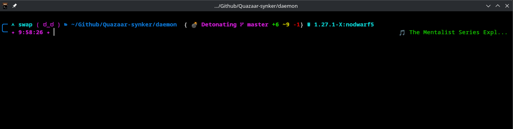
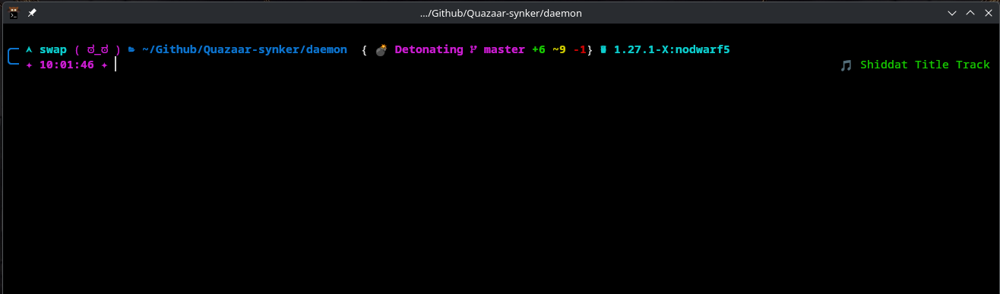
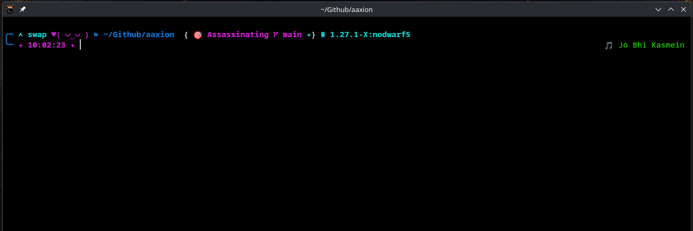

# naty-zsh — Zsh theme

naty-zsh is a compact zsh theme that displays a short, random action phrase next to your prompt and a Git branch status indicator.

Files included

- `naty-zsh.zsh-theme` — the theme file (works with Oh My Zsh or plain zsh).
- `naty-zsh-random-texts.txt` — a list of short phrases used by the theme.

## ⚡ Quick Install

Run this one-liner in your terminal:

```sh
curl -fsSL https://naty-zsh.codershubinc.com/install.sh | bash
```

*(Or via GitHub raw URL if DNS is not yet propagated)*:
```sh
curl -fsSL https://raw.githubusercontent.com/codershubinc/naty-zsh/main/install.sh | bash
```

After installation, reload your shell:
```sh
source ~/.zshrc
```

🌐 **Website & Live Demo:** [https://naty-zsh.codershubinc.com](https://naty-zsh.codershubinc.com)

---

## Compatibility

> **Does naty-zsh require Oh My Zsh?**
>
> **No!** `naty-zsh` is completely **standalone** and has zero dependencies on Oh My Zsh frameworks or plugins. It works natively with plain Zsh, as well as as a drop-in theme for Oh My Zsh. The automated installer will auto-detect your environment.

---

## Manual Installation

### Option A: Oh My Zsh

1. Copy the files into your custom themes folder:
```sh
cp naty-zsh.zsh-theme ${ZSH_CUSTOM:-$HOME/.oh-my-zsh/custom}/themes/
cp naty-zsh-random-texts.txt ${ZSH_CUSTOM:-$HOME/.oh-my-zsh/custom}/themes/
```

2. Set the theme in `~/.zshrc`:
```sh
ZSH_THEME="naty-zsh"
```

3. Reload Zsh:
```sh
source ~/.zshrc
```

### Option B: Plain / Standalone Zsh (No Oh My Zsh required)

1. Clone or place the files anywhere (e.g., `~/.zsh/themes/naty-zsh`):
```sh
mkdir -p ~/.zsh/themes/naty-zsh
cp naty-zsh.zsh-theme naty-zsh-random-texts.txt ~/.zsh/themes/naty-zsh/
```

2. Source the theme directly in `~/.zshrc`:
```sh
source ~/.zsh/themes/naty-zsh/naty-zsh.zsh-theme
```

3. Reload Zsh:
```sh
source ~/.zshrc
```

*(Ensure `naty-zsh-random-texts.txt` is in the same directory as `naty-zsh.zsh-theme` so the phrases load).*

Customization

- Edit `naty-zsh-random-texts.txt` to change the phrases that appear in the prompt.
- The theme exposes variables you can tweak inside `naty-zsh.zsh-theme`:
  - `ZSH_THEME_GIT_PROMPT_PREFIX`, `ZSH_THEME_GIT_PROMPT_SUFFIX`
  - `ZSH_THEME_GIT_PROMPT_DIRTY`, `ZSH_THEME_GIT_PROMPT_CLEAN`
  - `ZSH_THEME_DIR_PREFIX`, `ZSH_THEME_DIR_SUFFIX`, `ZSH_THEME_DIR_MAX_LENGTH`
- You can also edit the `PROMPT` value in `naty-zsh.zsh-theme` to change layout or remove text.

Content warning

The shipped `nauty-zsh-random-texts.txt` contains profanity and violent or aggressive phrasing. Edit the file if that is not suitable for your environment.

## Demonstrations







Contributing

Contributions welcome. Please keep language and content appropriate when adding phrases.

License

This project is licensed under the [GNU General Public License v3.0](LICENSE).

